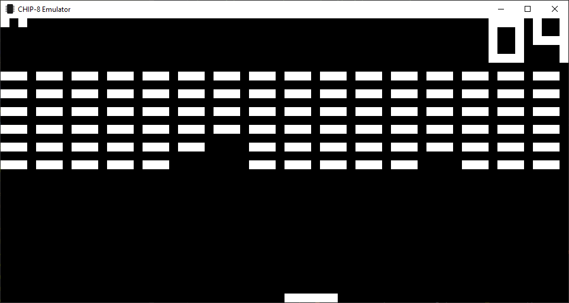

# CHIP-8 Emulator



## Building

Required Dependencies

Download and extract to lib/ before compiling
- fmt v6.1.2 [[link](https://fmt.dev/6.1.2/)]
- glfw v3.3.2 [[link](https://github.com/glfw/glfw/)]
- glew v2.1.0 [[link](https://github.com/nigels-com/glew)]

```
> cmake
```
